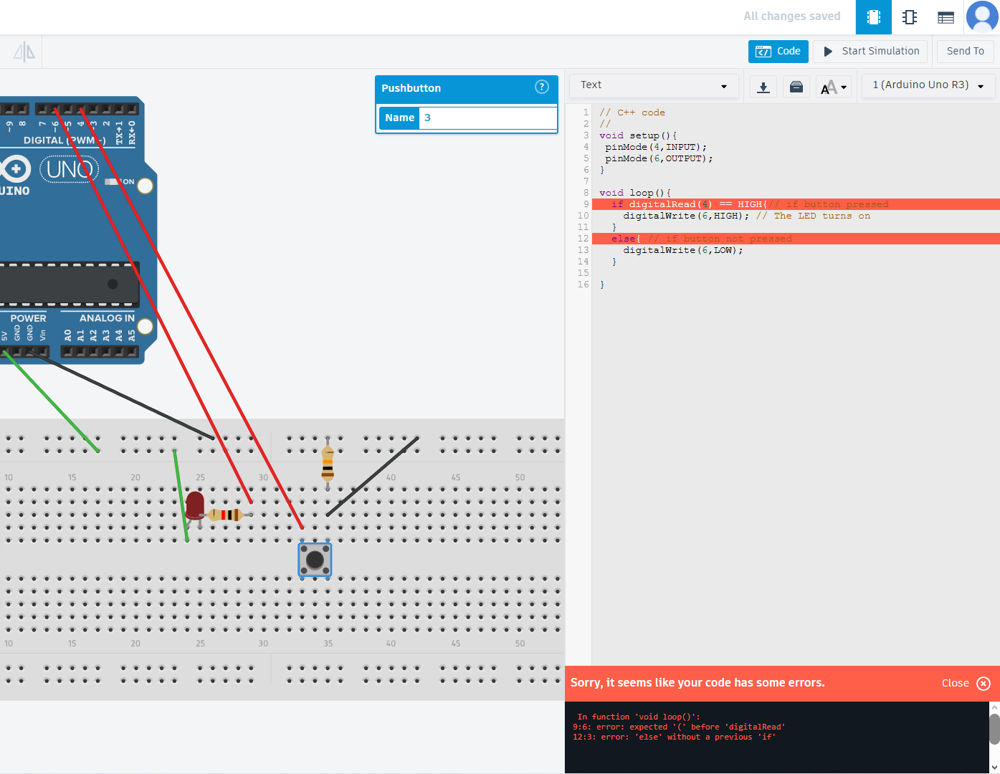
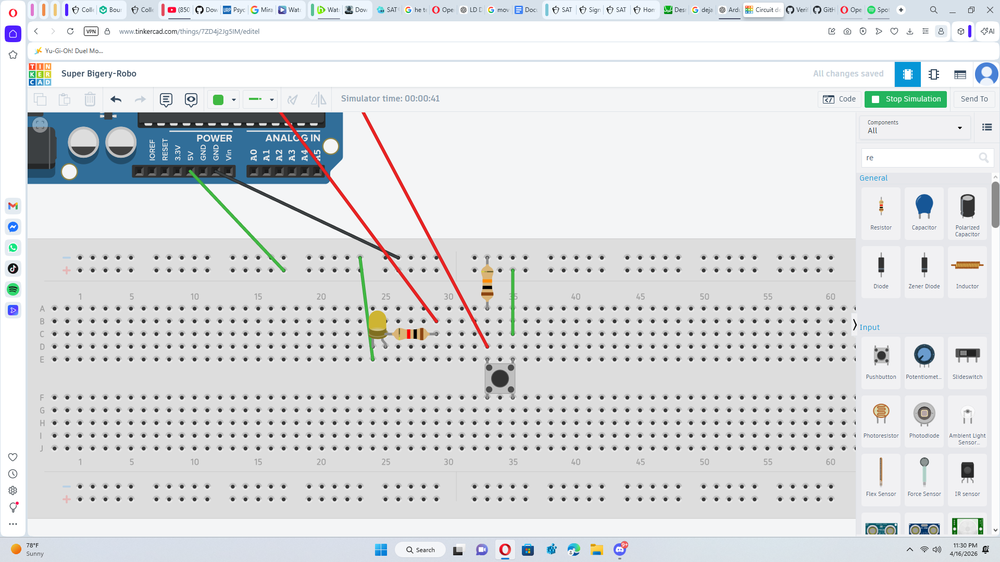

# arduino-button-fed-LED

## Goal
Light up an LED(OUTPUT) with a Button(INPUT)

## Items
- LED
- Resistor
- Breadboard
- Arduino
- Button

## First Attempt

I incorrectly wired the LED by connecting the cathode(negative leg) to the positive rail instead of ground. 
I also made a mistake in my coding when using digitalRead()

## Final Result

I fixed the wiring by connecting the LED to ground, and I fixed my digitalread() mistake.

## What I learned
- How Inputs and Output work in a system
- I practiced debugging both wiring and code issues
- i learned the basics of coding

## Future Improvements
- Integrate a timer
- Expand the project to control multiple LEDs
- Implement state based logic
